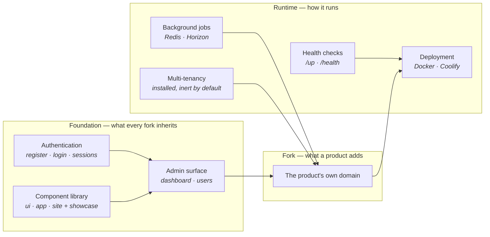

# Overview — Laravel starter template

*This describes the starter as designed. What is proven today is recorded row by row in the contracts —
[`prd/`](./prd/) for the ratified ones, [`prd-drafts/`](./prd-drafts/) for those still in proposal. A fresh
fork starts with these homes empty and fills them with its own product.*

## What this is

This is a Laravel + Inertia/Vue starter template: a production-shaped foundation a new product forks from
instead of a bare framework install. It is for the developers and agents building those products, and for
the forks that periodically pull upgrades back in. **It is not itself a product** — it ships the scaffolding
every product needs (auth, an admin surface, a component library, background jobs, health checks, optional
multi-tenancy, deployment) so a fork can start on its own domain from day one.

## The platform

## How it works

- **Authentication** — register, login, and session handling wired out of the box; a fork builds on it
  rather than standing it up.
- **Admin surface** — a dashboard and user management behind auth, the shape most products extend first.
- **Component library** — a `ui/` → `app/` → `site/` kit of shadcn-vue components with a live showcase to
  reuse before building anything new.
- **Background jobs** — Redis and Horizon configured for queued work and caching.
- **Health checks** — `/up` and `/health` endpoints a fork gates and points its monitoring at.
- **Multi-tenancy** — `stancl/tenancy` installed but inert, ready for a fork that needs many workspaces.
- **Deployment** — an optional Docker/Coolify setup whose managed core tracks this template.
- **The product's own domain** — everything above is the floor; a fork's real systems land in `prd/` and the
  app on top of this shell.

## What you use

- **The forking developer** — clones the template, runs one command, and has a working app with auth and an
  admin at `/admin`; from there they build their product.
- **The coding agent** — reads `.knowledge/` on every task and follows `AGENTS.md`, so every fork is built
  the same way.
- **The upstream owner** — improves the template here; forks pull each release in through a migration.
- **The end user of a fork** — never meets the template as such; they use whatever product the fork became.

## What governs it

- **The HTTP layer stays thin** — controllers delegate to services and actions, dependencies point one way.
  Set by the architecture rule. See [`../AGENTS.md`](../AGENTS.md).
- **Validation is server-side only** — Laravel Form Requests are the single source of truth; the frontend
  only displays returned errors. Set by the stack conventions. See [`../AGENTS.md`](../AGENTS.md).
- **Multi-tenancy is off until switched on** — while inert, tenancy code is treated as nonexistent. Set by
  `TENANCY_ENABLED`. See [`guides/tenancy-usage.md`](./guides/tenancy-usage.md).
- **Docker capabilities originate upstream** — a fork changes only documented knobs, never the managed core.
  Set by the template. See the docker guide.

---
*Editing this file? Follow the standard first: [`guides/docs-overview.md`](./guides/docs-overview.md).*
