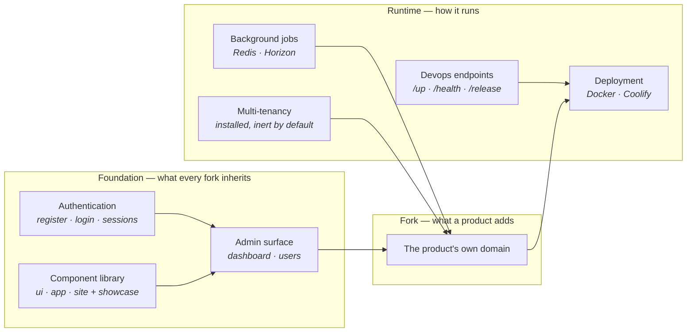

# The platform

This is a Laravel + Inertia/Vue starter template: a production-shaped foundation a new product forks from
instead of a bare framework install. **It is not itself a product** — it ships the scaffolding every
product needs, so a fork can start on its own domain from day one.

Its audience is the developers and agents building those products, and the forks that periodically pull
upgrades back in.

## The layers a fork inherits

| Layer | What it gives a fork |
|---|---|
| Authentication | Register, login and session handling wired out of the box |
| Admin surface | A dashboard and user management behind auth — the shape most products extend first |
| Component library | A `ui/` → `app/` → `site/` shadcn-vue kit with a live showcase to reuse before building anything |
| Background jobs | Redis and Horizon configured for queued work and caching |
| Devops endpoints | `/up`, `/health` and `/release` — see [deployment-endpoints.md](./deployment-endpoints.md) |
| Multi-tenancy | `stancl/tenancy` installed but inert, ready for a fork that needs many workspaces |
| Deployment | An optional Docker/Coolify setup whose managed core tracks this template |
| Release process | A versioned `production` branch and a tag published only after a verified deploy |

Everything above is the floor. A fork's own systems land on top of it.

## Who touches it

| Reader | What they do |
|---|---|
| The forking developer | Clones, runs one command, has a working app with auth and `/admin`, then builds a product |
| The coding agent | Reads `docs/` and follows `AGENTS.md`, so every fork is built the same way |
| The upstream owner | Improves the template here; forks pull each release in through a migration |
| The end user of a fork | Never meets the template; they use whatever product the fork became |

## How it fails

The failure modes are all about the fork relationship, because that is the only thing this repository
actually does.

| Failure | What it looks like |
|---|---|
| **A fork ships the template's own docs** | `BRIEF.md` describes a starter template rather than the product. Loaded on every future task and never re-checked, so an invented audience outlives whoever installed it. Rewriting these two pages is step one of adoption |
| **A fork edits the managed Docker core** | The next template upgrade conflicts, or silently reverts the fork's change. Only documented knobs are safe |
| **Tenancy is treated as live while inert** | Code paths behind `TENANCY_ENABLED=false` look reachable and are not. The default `phpunit.xml` also disables tenancy, so a green suite proves nothing about tenant behavior — `pnpm check:tenancy` is the one that does |
| **A health check is kept for a service the fork does not run** | The check fails forever, notifications flap, and the signal gets ignored. Checks self-gate on configuration, but a fork that hard-wires one defeats that |
| **A fork drifts silently** | Nothing warns when a fork falls behind. `template-manifest.json` records the version it is aligned with; the workspace tracker records where every fork sits |

## What governs it

| Rule | Set by |
|---|---|
| The HTTP layer stays thin — controllers delegate, dependencies point one way | [`AGENTS.md`](../../AGENTS.md) |
| Validation is server-side only; the frontend only displays returned errors | [`AGENTS.md`](../../AGENTS.md) |
| Multi-tenancy is off until switched on, and inert code counts as nonexistent | `TENANCY_ENABLED` — [`../guides/tenancy-using.md`](../guides/tenancy-using.md) |
| Docker capabilities originate upstream; a fork changes only documented knobs | The template — `docker/README.md` |
| `main` never carries a release version; a tag follows a verified deploy | [`../guides/releasing.md`](../guides/releasing.md) |
