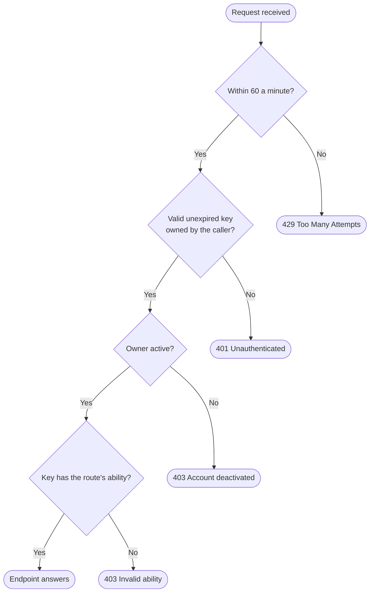

+++
title = "API"
subtitle = "bearer authentication, the request budget, and the endpoints"
status = "approved"
goals = false
intent = """
The API exists so that a machine holding a key reads application data over HTTPS with the same
authorisation its owner has in the browser. A request without a real key, or with a key its owner is
not allowed to use, should be refused before anything else runs.
"""

[family]
headings = ["Request", "Authentication", "Parameters", "Responses", "Errors", "Example"]
labels = ["Method", "Path", "Ability", "Page size", "Sort fields", "Returns", "Owner", "Fields"]
table = ["Ability", "Returns"]

[[infobox]]
group = "Identity"
rows = [
  { label = "Base path", value = "/api", cite = "chain" },
  { label = "Header", value = "Authorization: Bearer", cite = "chain" },
]

[[infobox]]
group = "Limits"
rows = [
  { label = "Budget", value = "60 requests a minute", note = "per key owner", cite = "budget" },
]

[[infobox]]
group = "Rules"
rows = [
  { label = "Browser session", value = "refused without a key", cite = "session" },
  { label = "Ability", value = "checked on every route", cite = "chain" },
]
+++

Every API request carries a key as a bearer token and passes four checks in order: the request budget,
the key, its owner's status and its ability.[^chain] Keys themselves are described on
[API keys](api-keys.md). The endpoints, [GET /api/user](api/user.md) and [GET /api/users](api/users.md), each
have a page covering the request, authentication, parameters, responses, errors and an example.

## Checks

A request is refused at the first check it fails, and the endpoint runs only when all four pass.[^chain]

A signed-in browser session presenting no key is refused, so an ability is always answered by a key and
never by a session.[^session]

## Refusals

| Condition | Status | Message |
|---|---|---|
| more than 60 requests in a minute from one key owner[^budget] | `429` | `Too Many Attempts.` |
| no bearer token, an unknown key, another account's key, or an expired key[^key] | `401` | `Unauthenticated.` |
| a key whose owner is deactivated[^inactive] | `403` | `Your account has been deactivated.` |
| a key without the route's ability[^ability] | `403` | `Invalid ability provided.` |

## Endpoints

{family-table}

[^chain]: `routes/api.php` — the group carries `throttle:api`, `auth:sanctum` and `api.key`, and each
    route `abilities:api:read`; the comment says each link is load-bearing.
[^budget]: `app/Providers/AppServiceProvider.php` — `configureRateLimiting()` gives `api`
    `Limit::perMinute(60)` keyed by the user's id, or the IP when there is none;
    `vendor/laravel/framework/src/Illuminate/Routing/Middleware/ThrottleRequests.php` —
    `buildException()` raises `Too Many Attempts.`.
[^key]: `app/Http/Middleware/EnsureApiKey.php` — `handle()` raises an authentication error when there is
    no user, no bearer, no matching key, a key of another account, or a past `expires_at`.
[^session]: `app/Http/Middleware/EnsureApiKey.php` — the class comment: a browser session counts as a
    token whose ability check passes for everything, so a real key is required and re-attached.
[^inactive]: `app/Http/Middleware/EnsureApiKey.php` — `handle()` aborts with 403 and
    `Your account has been deactivated.` when the owner is not active.
[^ability]: `vendor/laravel/sanctum/src/Exceptions/MissingAbilityException.php` — the message
    `Invalid ability provided.`, raised by the `abilities` middleware `bootstrap/app.php` aliases.
