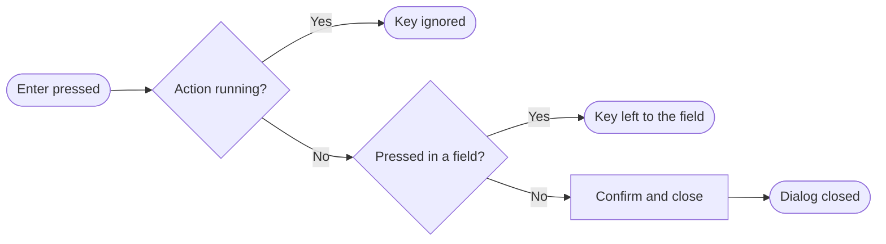

+++
title = "Confirmation dialogs"
subtitle = "the Confirm and Cancel dialog, its keyboard, and what it refuses while busy"
status = "approved"
goals = false
intent = """
Confirmation dialogs exist so that a destructive action asks once and answers the keyboard the same way
as the pointer: Enter confirms, Escape cancels, and a key held down can never repeat an action.
Confirming closes the dialog, whichever way it was confirmed.
"""

[[infobox]]
group = "Identity"
rows = [
  { label = "Buttons", value = "Cancel, Confirm", cite = "defaults" },
  { label = "Default title", value = "Confirm", cite = "defaults" },
  { label = "Default message", value = "Are you sure?", cite = "defaults" },
]

[[infobox]]
group = "Rules"
rows = [
  { label = "Enter", value = "confirms and closes", cite = "enter" },
  { label = "Escape", value = "closes without confirming", cite = "escape" },
  { label = "While busy", value = "Enter and the button do nothing", cite = "busy" },
  { label = "Enter in a field", value = "goes to the field", cite = "field" },
]
+++

A confirmation dialog asks one question and offers `Cancel` and a confirming button, `Confirm` unless
the screen names the action, such as `Archive` or `Revoke`.[^defaults][^uses] It is one part of the
[Component kit](../components.md).

## Confirming

Confirming, by the button or by Enter, tells the screen to act and closes the dialog in the same
gesture.[^confirm] A destructive dialog colours the confirming button as such, and while the action is
running the button shows a spinner and refuses a second press.[^defaults][^busy]

Enter reaches the dialog before any focused control, so it confirms even when `Cancel` holds the
focus, and is decided as follows.[^enter]

A held key cannot confirm twice, because the second press arrives while the action is running.[^busy]
A dialog that carries a text field, for a name typed to confirm, leaves Enter to that field.[^field]

## Cancelling

Escape closes the dialog and returns focus to whatever opened it, and `Cancel` does the same by
pointer.[^escape]

## Uses

Archiving a user asks `Are you sure you want to archive this user? This action can be undone.` with the
button `Archive`, and revoking an API key asks `Revoke “NAME”? Any caller using it stops working
immediately, and this cannot be undone.` with the button `Revoke`.[^uses]

[^defaults]: `resources/js/components/ui/dialog/DialogConfirmation.vue` — the props default `title` to
    `Confirm`, `message` to `Are you sure?` and `confirmLabel` to `Confirm`; the footer renders
    `AlertDialogCancel` labelled `Cancel` and the action button, styled `destructive` when that prop is
    set and showing `Loader2` while `loading`.
[^confirm]: `resources/js/components/ui/dialog/DialogConfirmation.vue` — `handleConfirm()` emits
    `confirm` and sets the dialog closed.
[^enter]: `resources/js/components/ui/dialog/DialogConfirmation.vue` — `onKeydown()` is bound to the
    document in the capture phase while the dialog is open, and on Enter prevents the default,
    stops propagation and calls `handleConfirm()`.
[^busy]: `resources/js/components/ui/dialog/dialogUtils.ts` — `shouldConfirmOnEnter()` returns false
    while `loading` is true; `DialogConfirmation.vue` — the action button is `disabled` while
    `loading`.
[^field]: `resources/js/components/ui/dialog/dialogUtils.ts` — `shouldConfirmOnEnter()` returns false
    when the key was pressed in an `INPUT`, `TEXTAREA` or `SELECT`.
[^escape]: Reka UI — [Alert Dialog](https://reka-ui.com/docs/components/alert-dialog): the keyboard
    table states that Escape closes the dialog and moves focus to the trigger;
    `resources/js/components/ui/dialog/DialogConfirmation.vue` — the dialog is an `AlertDialog`, and
    the comment on `onKeydown()` leaves Escape to it.
[^uses]: `resources/js/components/app/modals/DeleteUserModal.vue` — title `Archive user`, that message
    and `confirmLabel="Archive"`, `destructive`, `loading` bound to the form;
    `resources/js/pages/admin/api-keys/Index.vue` — title `Revoke API key`, that message and
    `confirmLabel="Revoke"`.
