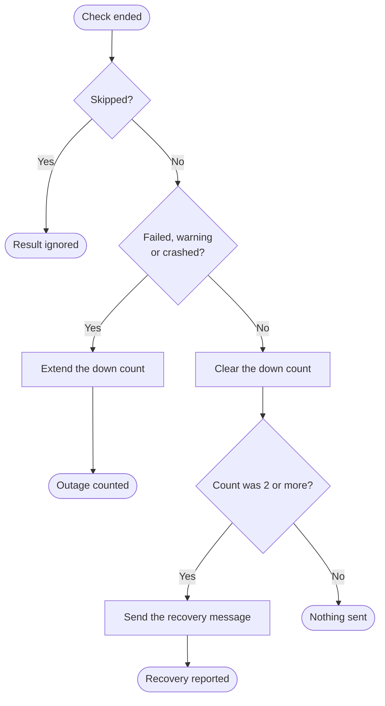

+++
title = "Notifications"
subtitle = "failure, recovery and maintenance-mode messages to Discord, mail and Slack"
status = "approved"
goals = false
intent = """
Notifications exist so that the operator hears once when a dependency fails, once when it recovers, and
when the application is taken down for maintenance, without a message every minute and without one for
a single blip.
"""

[[infobox]]
group = "Identity"
rows = [
  { label = "Setting", value = "HEALTH_NOTIFICATIONS_ENABLED", cite = "enabled" },
  { label = "Channels", value = "Discord, mail, Slack", cite = "enabled" },
]

[[infobox]]
group = "Values"
rows = [
  { label = "Failure throttle", value = "60 minutes", cite = "throttle" },
  { label = "Recovery after", value = "2 consecutive down runs", cite = "recovery" },
  { label = "Checks per Discord message", value = "10", cite = "discord" },
]

[[infobox]]
group = "Rules"
rows = [
  { label = "Default", value = "off", cite = "enabled" },
  { label = "Recovery and maintenance", value = "Discord only", cite = "recovery" },
]
+++

Notifications are off until `HEALTH_NOTIFICATIONS_ENABLED` is `true`, and each channel sends only when
its destination is set: `HEALTH_DISCORD_WEBHOOK_URL` for Discord, `HEALTH_TO_ADDRESS` for mail and
`HEALTH_SLACK_WEBHOOK_URL` for Slack.[^enabled] Which checks run, and when, is described on
[Health checks](../health.md).

## Failure

When a scheduled run ends with a check in a failed or warning state, one failure notification goes to
every configured channel, and then none for the next 60 minutes, whatever later runs find.[^throttle] On
Discord the message reads `🔴 Health check failed on **APP** (production) — 2 issues`, with one embed per
check, coloured by its status, for at most ten checks.[^discord] Slack needs a package the template does
not install.[^slack]

A Discord outage never breaks a check run: a rejected or failed post is logged as a warning and the run
continues.[^webhook]

## Recovery

Recovery messages go to Discord only.[^recovery] A check counts as down only after 2 consecutive runs in a
failed, warning or crashed state, so a single blip produces no recovery message; when a counted outage
ends, one message reads `✅ Recovered on **APP** (production) — Database is healthy again.`[^recovery] A
skipped check neither extends nor clears the count.[^recovery] Each check's result on a scheduled run
goes through the decision below.[^recovery]

## Maintenance mode

`php artisan down` posts `🚧 **APP** (production) entered maintenance mode.` to Discord, and
`php artisan up` posts `✅ **APP** (production) is back online.`, under the same two settings.[^maintenance]
A crashed application posts nothing, because the messages are sent from inside it; detecting an
unreachable application is the job of a monitor watching `/health` from outside.[^maintenance]

[^enabled]: `config/health.php` — `notifications.enabled` reads `HEALTH_NOTIFICATIONS_ENABLED`, default
    `false`, and `notifications.notifications` lists `mail`, `discord` and `slack` only where
    `HEALTH_TO_ADDRESS`, `HEALTH_DISCORD_WEBHOOK_URL` or `HEALTH_SLACK_WEBHOOK_URL` is set.
[^throttle]: `config/health.php` — `throttle_notifications_for_minutes` is 60 and `only_on_failure` is
    `false`, which `vendor/spatie/laravel-health/src/Commands/RunHealthChecksCommand.php` reads before
    sending `CheckFailedNotification`.
[^discord]: `app/Health/DiscordHealthChannel.php` — `send()` builds the content line with `sprintf()` and
    one embed per result from `array_slice($results, 0, 10)`, coloured by `COLORS`.
[^slack]: `config/health.php` — the comment on `notifications` names `laravel/slack-notification-channel`;
    `composer.json` — `require` does not list it.
[^webhook]: `app/Health/DiscordWebhook.php` — `send()` returns when the webhook is blank, posts with a
    10-second timeout, and logs `Discord health notification rejected` or `Discord health notification
    failed to send` instead of throwing.
[^recovery]: `app/Health/Listeners/NotifyOnHealthRecovery.php` — `handle()` returns for a `skipped`
    result, counts `DOWN` statuses under the `health:downStreak:` cache key, and sends the message only
    when the count had reached `CONFIRM_AFTER`, 2, before an ok result; it requires the Discord webhook.
[^maintenance]: `app/Health/Listeners/NotifyOnMaintenanceMode.php` — `enabled()` and `disabled()` send
    the two messages when `shouldNotify()` finds the flag and the webhook set; the class comment states
    that a fully-down application cannot notify and points at an external monitor.
