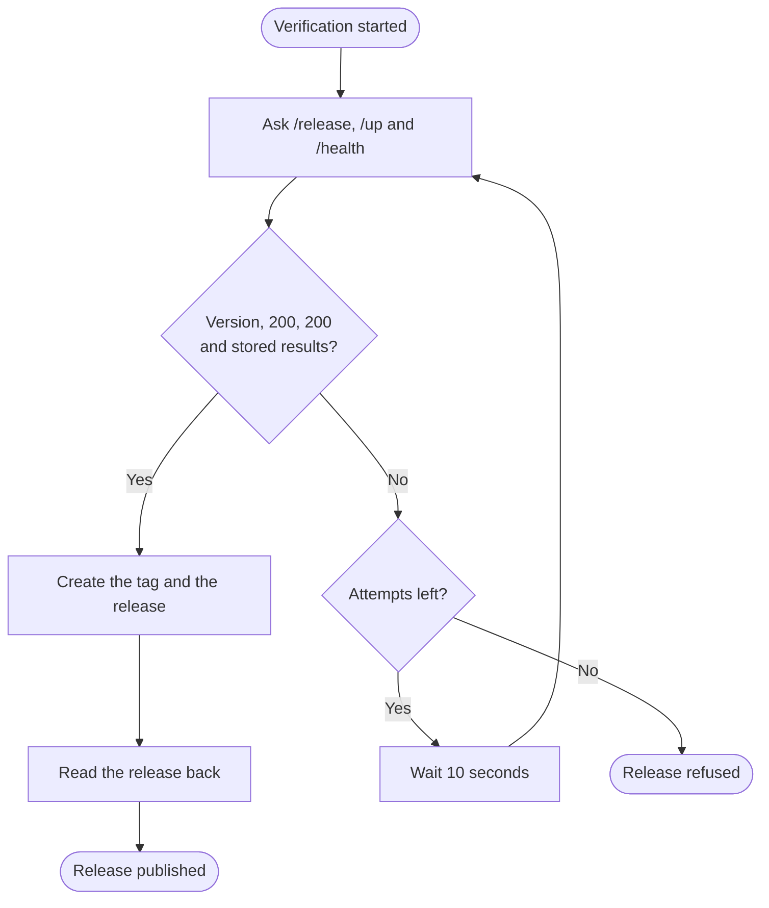

+++
title = "Publication"
subtitle = "scripts/publish-production-release --confirm"
status = "approved"
goals = false
intent = """
Publication exists so that the tag and the GitHub release name a commit that production is proved to be
running and to be healthy on. A deploy that is still starting, or whose checks have not been stored,
should hold the tag back rather than let it through.
"""

[[infobox]]
group = "Identity"
rows = [
  { label = "Command", value = "scripts/publish-production-release", cite = "usage" },
  { label = "Argument", value = "--confirm", cite = "usage" },
  { label = "Settings", value = "RELEASE_VERIFY_ATTEMPTS, RELEASE_VERIFY_INTERVAL_SECONDS", cite = "loop" },
]

[[infobox]]
group = "Values"
rows = [
  { label = "Attempts", value = "90", cite = "loop" },
  { label = "Pause between attempts", value = "10 seconds", cite = "loop" },
  { label = "Request timeout", value = "15 seconds", cite = "loop" },
]

[[infobox]]
group = "Exit codes"
rows = [
  { label = "Success", value = "0", cite = "publish" },
  { label = "Refused", value = "1", cite = "fail" },
  { label = "Misuse", value = "2", cite = "usage" },
]
+++

`scripts/publish-production-release --confirm` waits until production serves the version stored in the
manifests, then creates the Git tag and the GitHub release on that commit and reads both back.[^publish]
It is the third of the four steps described on [Releases](../releases.md), before
[Reconciliation](04-reconciliation.md).

## Usage

The script runs on a checkout of the production branch whose head equals the branch on `origin`.[^head]
```sh
scripts/publish-production-release --confirm
```

## Verification

The script asks the production address three questions on each attempt, up to 90 times, 10 seconds
apart, and each request gives up after 15 seconds: `/release` reports the stored version, `/up` answers
`200`, and `/health` answers `200` with a stored `checkResults`.[^loop] `RELEASE_VERIFY_ATTEMPTS` and
`RELEASE_VERIFY_INTERVAL_SECONDS` change the count and the pause.[^loop] A `200` from `/health` with no
stored results does not count, for the reason described on [Health checks](../health.md).[^cold] Each
attempt that falls short prints one line.[^loop]
```text
Waiting for v1.2.3: deployed=1.2.2, up=200, health=200, checks-stored=no (3/90)
```

Nothing is tagged before the loop passes.[^loop]



## Output

On success the last line names the release.[^publish]
```text
Published v1.2.3: https://github.com/owner/repo/releases/tag/v1.2.3
```

When the tag already points at the production head and no release exists, the script prints one more
line after verification and before it creates the release, with `COMMIT` standing for the head
commit.[^verified]
```text
Verified existing tag v1.2.3 at production commit COMMIT.
```

A refusal against the shipped manifest, from a local run:[^manifest]
```text
Production release refused: deploy.repository: deploy.repository is still the template placeholder (owner/repo)
```

## Exit codes

The script exits 0 once the release is read back, and 1 on every refusal, which prints
`Production release refused:` and the reason; anything but a single `--confirm` argument exits 2.[^publish][^fail][^usage]
Every outcome, with its code and its message word for word, is listed on
[Exit codes](03-publication/exit-codes.md).

[^publish]: `scripts/publish-production-release` — after verification, `gh release create` with
    `--target` the head commit and `--generate-notes`, then `gh release view` and `remote_tag_commit()`
    confirm the tag points at the head; the last Python block prints `Published {tag}: {url}`.
[^usage]: `scripts/publish-production-release` — `usage()` prints the usage line to standard error and
    the script exits 2 unless the one argument is `--confirm`.
[^head]: `scripts/publish-production-release` — the `head_commit` check against
    `origin/${production_branch}` after `git fetch`.
[^loop]: `scripts/publish-production-release` — the `for` loop over `attempts`, default 90, sleeping
    `interval`, default 10, with `curl --max-time 15` for each of `/release`, `/up` and `/health`, the
    `Waiting for` line, and the final `fail()` message.
[^cold]: `scripts/publish-production-release` — the `health_checked` test and its comment.
[^fail]: `scripts/publish-production-release` — `fail()` prints `Production release refused:` with the
    reason and exits 1; every check from line 20 to line 171 calls it in turn, including the clean-tree
    (line 64), `gh auth` (line 72) and repository (line 73) checks, and the two Python blocks that raise
    `SystemExit` print the same prefix themselves, which `set -e` turns into exit 1.
[^manifest]: `scripts/publish-production-release` — `manifest_deploy()` exits with `template-manifest.json
    is missing`, `template-manifest.json has no valid deploy block`, `deploy.{key} is missing` or
    `deploy.{key} is still the template placeholder ({value})`, for the placeholders `owner/repo` and
    `https://example.com`, and lines 59 to 61 read `repository`, `productionUrl` and `productionBranch` in
    that order, each wrapping the message in `fail "deploy.{key}: …"`; `template-manifest.json` — ships
    `owner/repo`, `https://example.com` and `production`; the sample is the output of a local run against
    the shipped manifest.
[^verified]: `scripts/publish-production-release` — lines 158 to 160 print `Verified existing tag ${tag}
    at ${production_branch} commit ${head_commit}.` when `remote_tag_commit()` found the tag, which by then
    points at the head, after the verification loop and before `gh release create` on line 162; an
    existing release has already ended the script by line 114.
